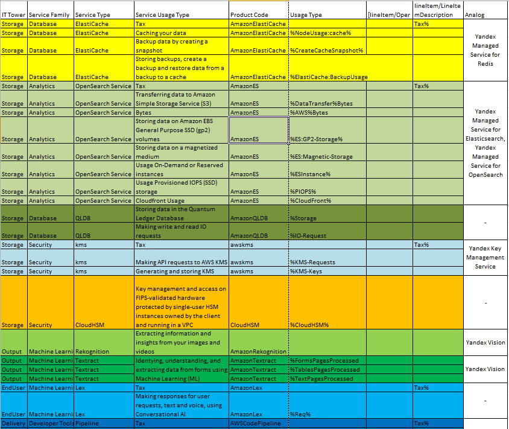

# Аналитическая лабораторная работа №1 (AWS). Вариант 3

Cостав команды **3 кота**: 
+ **Бабаев Руслан**
+ **Абоимов Артём**
+ **Акулов Даниил**

## Цель работы

Знакомство с облачными сервисами. Понимание уровней абстракции над инфраструктурой в облаке. Формирование понимания типов потребления сервисов в сервисной-модели. Сопоставление сервисов между разными провайдерами. Оценка возможностей миграции на отечественные сервисы.

## Дано

1. Слепок данных биллинга от провайдера после небольшой обработки в виде SQL-параметров. Символ % в начале/конце означает, что перед/после него может стоять любой набор символов.
2. Google с документациями провайдера

## Ход работы
Мы решили не использовать элементы модели Apptio TBM Unified Model (ATUM). Используя официальные документации от Amazon, мы нашли почти все сервисы, кроме Amazon ES. Мы обнаружили, что Amazon ES - это Amazon Elasticsearch Service, который компания Amazon переименовала в Amazon OpenSearch Service несколько лет назад. Поэтому вместо Amazon Elasticsearch Service мы описали Amazon OpenSearch Service и его подвиды, а также отечественные аналоги Amazon Elasticsearch Service и Amazon OpenSearch Service. 
 
 Не для всех сервисов от Amazon удалось найти отечественные аналоги.
## Описание сервисов AWS

**Amazon ElastiCache** – это бессерверный сервис для кэширования, совместимый с Redis и Memcached. ElastiCache повышает производительность интернет приложений благодаря кэшированию, позволяет очень быстро создавать кэш, хранить данные сеансов, создавать таблицы лидеров.

**Amazon OpenSearch Service** – это сервис, который позволяет искать на сайтах, в приложениях, мониторить события c помощью OpenSearch и ElasticSearch.

**Amazon OpenSearch бессерверный** – это бессерверный вариант Amazon OpenSearch, в котором не нужно настраивать, масштабировать кластеры OpenSearch и управлять ими.

**Amazon QLDB** - это полностью управляемая база данных реестров, обеспечивающая прозрачный, неизменяемый и проверяемый криптографическими методами журнал транзакций. Позволяет вести полный и точный учет всех финансовых транзакций, записывать историю каждой транзакции, сохранять историю запросов, проверять с помощью криптографии целостность данных.

**AWS Key Management Service (KMS)** позволяет создавать криптографические ключи для сервисов AWS и управлять этими ключами. Также с помощью KMS можно добавлять цифровые подписи и шифрование в код приложений, импортировать ключи из других инфраструктур управления ключами. KMS использует аппаратные модули безопасности (HSM), которые проверяются с помощью Федерального стандарта по обработке информации (FIPS) 140-2.

**AWS CloudHSM** позволяет создавать криптографические ключи, управлять ключами и получать к ним доступ на оборудовании, прошедшем проверку FIPS, защищенном принадлежащими клиенту инстансами HSM с одним арендатором, которые работают в виртуальном частном облаке клиента. CloudHSM можно применять в шифровании баз данных, управлении цифровыми правами (DRM), инфраструктуре открытых ключей (PKI), аутентификации и авторизации, подписи документов и обработке транзакций.

**Amazon Rekognition** позволяет автоматизировать распознавание изображений и анализ видео с помощью машинного обучения и снизить сопутствующие затраты. С помощью Amazon Rekognition можно распознавать и сравнивать лица, выявлять потенциально опасный контент на изображениях и видео, обнаруживать определенные объекты и текст, находить ключевые сегменты видео.

**Amazon Textract** – сервис машинного обучения, который автоматически извлекает печатный и рукописный текст, элементы макета и данные из сканированных документов. Textract позволяет  быстро настроить автоматическую обработку документов с помощью одной из предварительно обученных или пользовательских функций и указать с помощью запросов данные, которые необходимо извлечь, обнаруживает подписи, сохраняет состав данных, которые хранятся в таблицах, во время извлечения, возвращает оценку достоверности для всего, что он идентифицирует, чтобы клиенты могли принимать обоснованные решения о том, как использовать результаты. Textract способен извлечь данные всего за несколько минут, вместо часов или дней.

**Amazon Lex** – это сервис для создания голосовых и текстовых чатботов с использованием искусственного интеллекта. Он помогает распознавать речь и понимать язык. 

**Amazon Lex Automated Chatbot Designer** – конструктор чат-ботов, помогает создавать чат-боты с использованием машинного обучения на основе уже существующих стенограмм. За несколько часов сервис может проанализировать тысячи строк стенограмм, что позволит сократить ручные усилия, позволяет создать первоначальную версию чат-бота, которую затем можно усовершенствовать.

**AWS CodePipeline** – это сервис непрерывной доставки и непрерывной интеграции для быстрого и надежного обновления инфраструктуры. CodePipeline автоматизирует работу конвейеров, а конвейеры определяют ход выполнения процесса выпуска и показывают, как изменения в коде проходят различные этапы процесса выпуска. В CodePipeline есть графический интерфейс пользователя для создания и настройки конвейера, также графический интерфейс позволяет управлять конвейером и его элементами, визуализировать процесс выпуска. Также есть возможность параллельного выполнения процесса выпуска.

**Amazon Simple Email Service** – облачный сервис электронной почты от Amazon. Позволяет отправлять большое количество писем за короткое время, предоставляет статистику по доставке писем, дает советы, как улучшить доставку, позволяет фильтровать входящие письма. AmazonSES поддерживает все стандартные механизмы аутентификации, различные варианты развертывания: собственные, общие, выделенные ip-адреса. 

**Amazon Simple Notification Service (SNS)** – сервис уведомлений, который позволяет отправлять большое количество push-уведомлений между распределенными системами, микросервисами и бессерверными приложениями на основе событий по модели “многие ко многим”, а также присылать клиентам текстовые электронные письма, SMS-сообщения и push-уведомления. Отправленные сообщения хранятся на разных географически изолированных серверах и центрах обработки данных. Если адрес получателя недоступен, то Amazon SNS повторно отправляет недоставленные письма. Позволяет приложениям, получающим уведомления, фильтровать уведомления, обеспечивает шифрование сообщений с помощью сервиса AWS KMS. 

## Маппинг AWS сервисов на российские аналоги

В таблице представлены сервисы от Amazon, их отечественные аналоги и описания отечественных аналогов.

| **Сервис AWS** | **Отечественный аналог** | Описание |
| --- | --- | --- |
| Amazon ElastiCache  | Yandex Managed Service for Redis | Yandex Managed Service for Redis помогает создавать и поддерживать кластеры серверов Redis в Yandex Cloud, что позволяет кэшировать данные. Также с помощью сервиса можно создавать таблицы лидеров, хранить сессии состояний.  Однако нет поддержки для Memcached.|
| Amazon OpenSearch Service | Yandex Managed Service for Elasticsearch, Yandex Managed Service for OpenSearch  | Yandex Managed Service for Elasticsearch помогает создавать и поддерживать кластеры серверов Elasticsearch в Yandex Cloud.  Yandex Managed Service for OpenSearch помогает создавать и поддерживать кластеры серверов OpenSearch в Yandex Cloud.|
| Amazon QLDB | Нет отечественного аналога |  |
| AWS KMS | Yandex Key Management Service | Yandex Key Management Service – сервис, с помощью которого можно создавать ключи шифрования и управлять ими в Yandex Cloud, а также шифровать и расшифровывать данные. В Yandex Key Management Service есть возможность создавать и управлять ключами только внутри HSM, которые поставляются ООО "КриптоПро", создавать и проверять электронные подписи. |
| AWS CloudHSM  | Нет отечественного аналога | |
| Amazon Rekognition, Amazon Textract | Yandex Vision | Yandex Vision – сервис компьютерного зрения, который умеет определять качество изображения, модерировать изображения, кодировать изображения в Base64, распознавать строки текста, рукописный текст, таблицы, документы (паспорт или водительское удостоверение), текст на изображения, из PDF-файла. Yandex Vision умеет обнаруживать лица на изображения, но не умеет распознавать лица, то есть не может находить похожие лица или идентифицировать личность человека. Также Yandex Vision не умеет анализировать видео, а Amazon Rekognition это может.|
| Amazon Lex | Нет отечественного аналога | |
| AWS CodePipeline | Нет отечественного аналога | |
| Amazon SES | Yandex Cloud Postbox  | Yandex Cloud Postbox – сервис для отправки транзакционных писем (письма подтверждения покупок и т.д.). Пока с помощью сервиса можно отправить письмо не более 5 получателям.|
| Amazon SNS | Simple Message Notification от cloud.ru  | Simple Message Notification от cloud.ru – это сервис для отправки уведомлений или сообщений на электронную почту, который передает сообщения по модели “издатель-подписчик”, как и Amazon SNS.  |

## Итоговая таблица

Получили итоговую таблицу:

## Вывод

В ходе данной лабораторной работы нам удалось познакомиться с некоторыми облачными сервисами AWS. Заметим, что не у всех представленных сервисов от Amazon есть отечественные аналоги. У некоторых аналогов есть не все функции, также у некоторых аналогов нет такой высокой производительности, как у сервисов от Amazon. Однако считаем, что миграция на отечественные сервисы возможна, так как у большинства сервисов есть отечественные аналоги.
